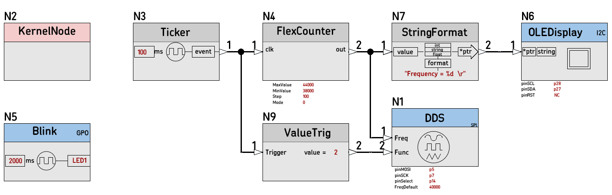
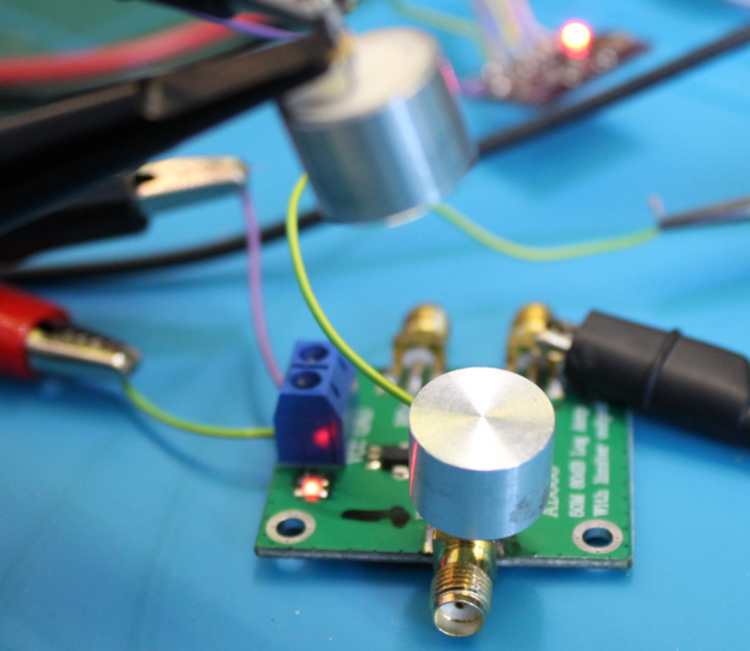
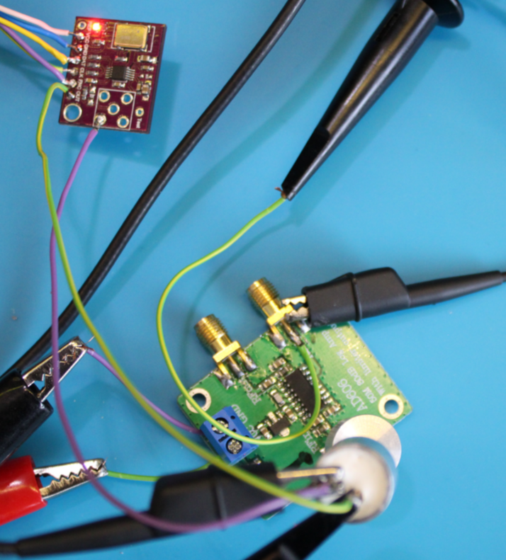
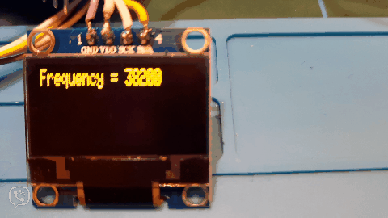
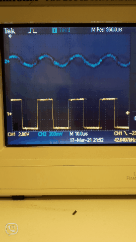

# [37D_DDS_test](https://github.com/nBlocksStudioApps/37D_DDS_test_FIRMWARE)

Testing program for the Node DDS, scanning in the range of 40KHz driving an ultrasonic transmitting trancducer and evaluating the reception on a receiving trancducer connected to a logarithmic amplifier

## nBlocksStudio Schematic Design

----

## Testing setup

----

## Frequency responce

----

----