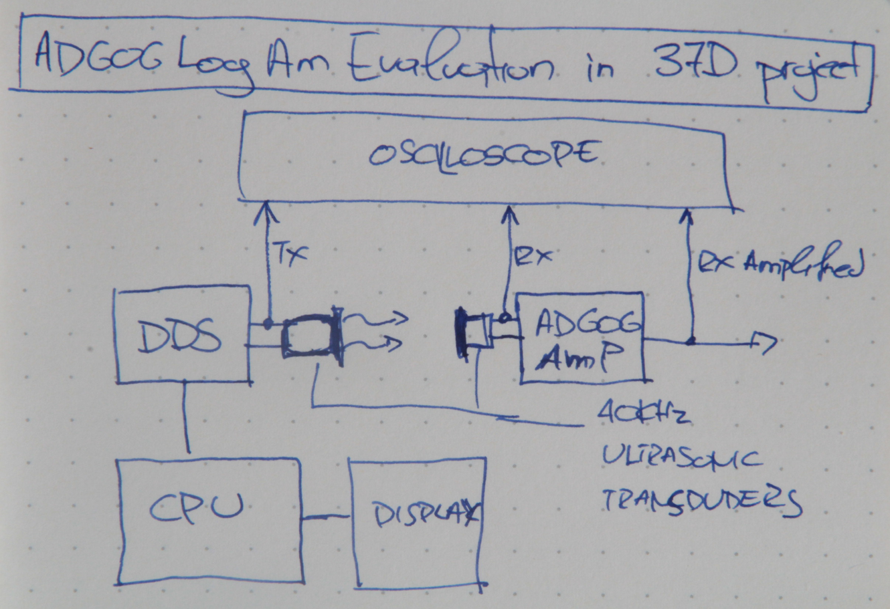
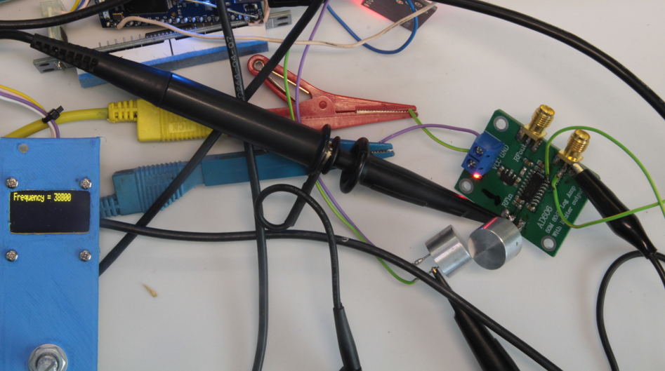
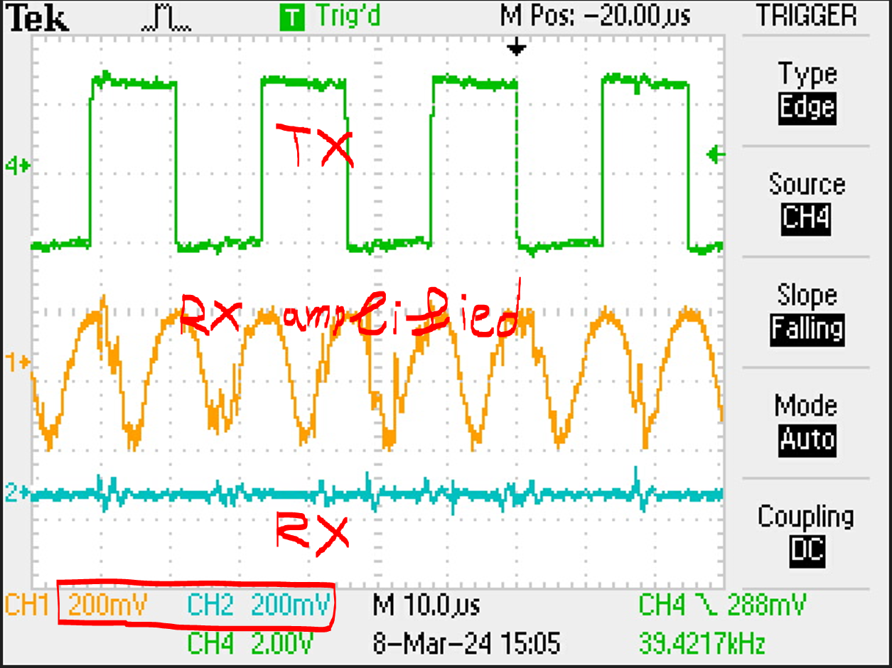
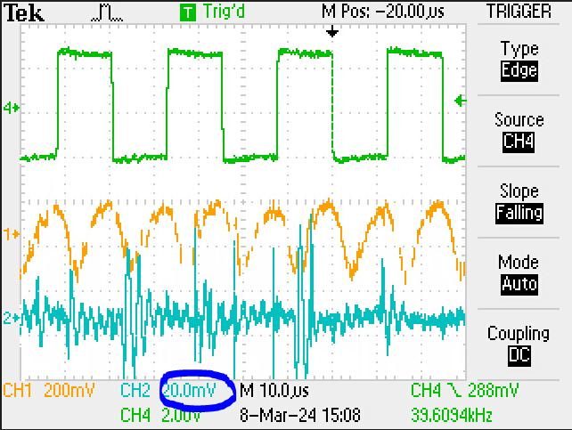
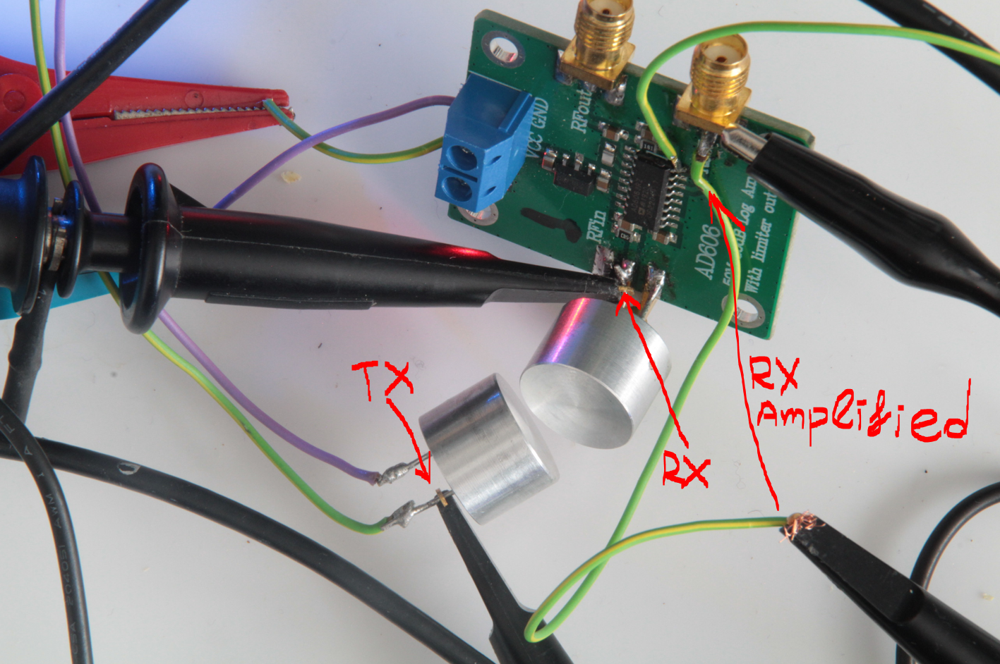

# [37D_DDS_test](https://github.com/nBlocksStudioApps/37D_DDS_test_FIRMWARE)

Testing program for the Node DDS, scanning in the range of 40KHz driving an ultrasonic transmitting trancducer and evaluating the reception on a receiving trancducer connected to a logarithmic amplifier

## nBlocksStudio Schematic Design

----

## Testing setup

----

## Frequency responce

----

----

## Review 08/03/2024
Evaluation of AD606 Logarithmic Amplifier Low cost Board, to be used as input amplifier for Piezoelectric Ultrasonic and sonic receiver

 

`image 10: Setup diagram for AD606 Logarithmic amplifier evaluation`

----

 

`image 06: Setup photo. for AD606 Logarithmic amplifier evaluation`

----

 

`image 07: Signals view with oscilloscope. The Amplified signal is clearly visible and measurable, while the RAW received signal is hard to detect and measure`

----

 

`image 08: Signals view with oscilloscope. The RAW received signal is amplified with Oscilloscope 10 times more than the Amplified. Still not clean`

----

 

`image 09: Physical points where the oscilloscope is connected`

----